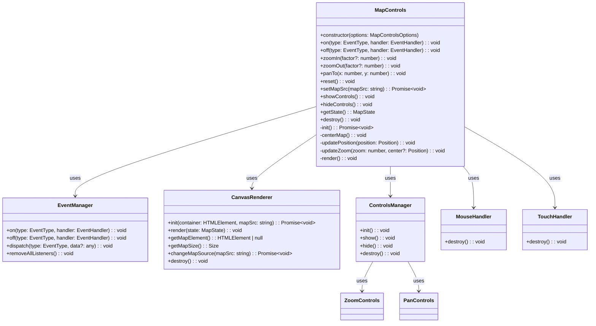

# API Reference

This section provides detailed documentation for all the components, classes, interfaces, and methods available in the Map Controls module.

## Core Components

<div class="api-grid">
  <a href="mapcontrols.md" class="api-item">
    <h3>MapControls</h3>
    <p>The main class for creating and managing map controls</p>
  </a>
  <a href="types.md" class="api-item">
    <h3>Types & Interfaces</h3>
    <p>Type definitions used throughout the module</p>
  </a>
  <a href="constants.md" class="api-item">
    <h3>Constants</h3>
    <p>Default values and configuration constants</p>
  </a>
</div>

## Event Handling

<div class="api-grid">
  <a href="eventmanager.md" class="api-item">
    <h3>EventManager</h3>
    <p>Manages event listeners and dispatching</p>
  </a>
  <a href="mousehandler.md" class="api-item">
    <h3>MouseHandler</h3>
    <p>Handles mouse interactions with the map</p>
  </a>
  <a href="touchhandler.md" class="api-item">
    <h3>TouchHandler</h3>
    <p>Handles touch interactions with the map</p>
  </a>
</div>

## Rendering

<div class="api-grid">
  <a href="canvasrenderer.md" class="api-item">
    <h3>CanvasRenderer</h3>
    <p>Renders the map using HTML Canvas</p>
  </a>
</div>

## Controls

<div class="api-grid">
  <a href="controlsmanager.md" class="api-item">
    <h3>ControlsManager</h3>
    <p>Manages UI controls for the map</p>
  </a>
  <a href="zoomcontrols.md" class="api-item">
    <h3>ZoomControls</h3>
    <p>Provides zoom in/out functionality</p>
  </a>
  <a href="pancontrols.md" class="api-item">
    <h3>PanControls</h3>
    <p>Provides directional panning functionality</p>
  </a>
</div>

## Utilities

<div class="api-grid">
  <a href="mathutils.md" class="api-item">
    <h3>Math Utilities</h3>
    <p>Mathematical functions for map operations</p>
  </a>
  <a href="domutils.md" class="api-item">
    <h3>DOM Utilities</h3>
    <p>DOM manipulation helpers</p>
  </a>
</div>

## Class Hierarchy

The following diagram shows the relationship between the main classes in the Map Controls module:



## Events

The Map Controls module provides the following events that you can listen for:

| Event | Description | Callback Data |
|-------|-------------|---------------|
| `load` | Fired when the map is loaded | `MapState` |
| `zoom` | Fired when the zoom level changes | `number` (zoom level) |
| `pan` | Fired when the map is panned | `Position` (x, y coordinates) |
| `error` | Fired when an error occurs | `Error` object |

Example usage:

```typescript
mapControls.on('zoom', (level) => {
  console.log(`Zoom level changed to: ${level}`);
});
```

## Configuration Options

The `MapControlsOptions` interface provides the following configuration options:

| Option | Type | Default | Description |
|--------|------|---------|-------------|
| `container` | `HTMLElement` | (required) | DOM element to contain the map |
| `mapSrc` | `string` | (required) | Path to the map image |
| `initialZoom` | `number` | `1` | Initial zoom level |
| `initialPosition` | `Position` | `null` | Initial position (null means center) |
| `minZoom` | `number` | `0.5` | Minimum zoom level |
| `maxZoom` | `number` | `3` | Maximum zoom level |
| `showControls` | `boolean` | `true` | Whether to show control buttons |
| `controlsPosition` | `string` | `'bottom-right'` | Position of the controls |
| `zoomStep` | `number` | `0.1` | Zoom step for zoom in/out operations |
| `panStep` | `number` | `50` | Pan step for pan operations in pixels |

For more detailed information about each component, click on the corresponding link above.
