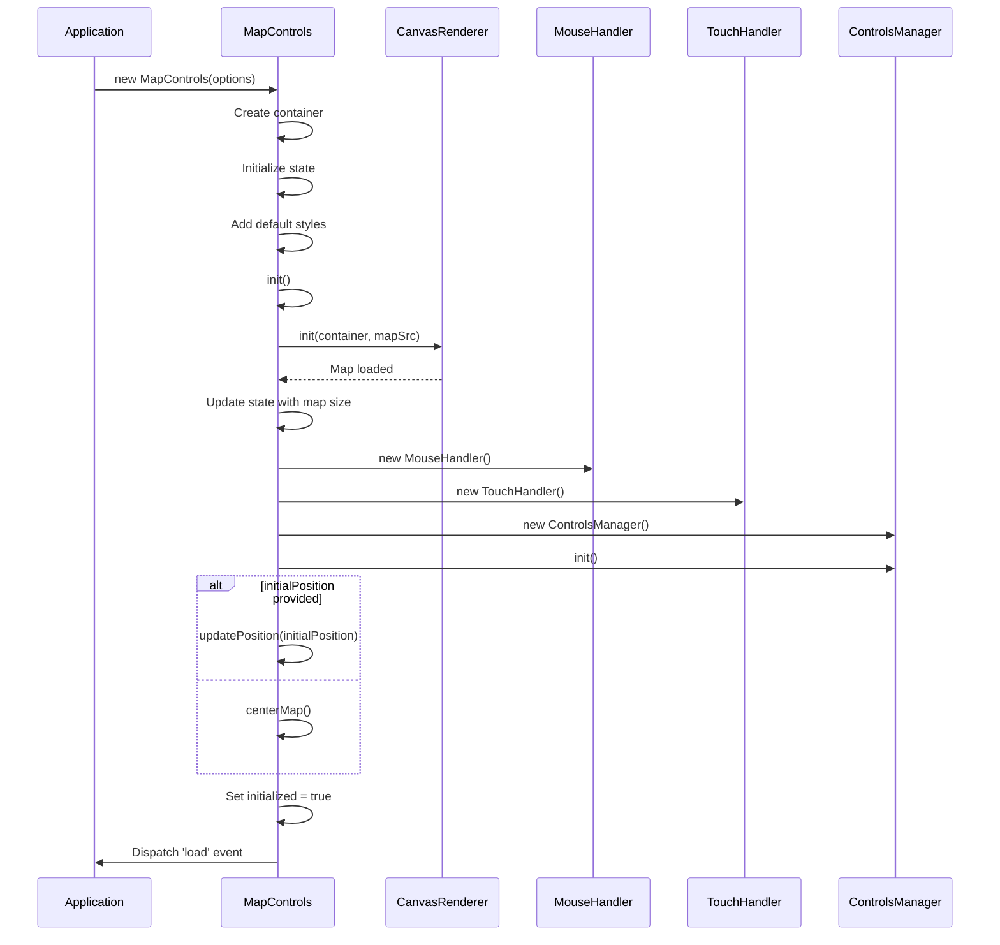
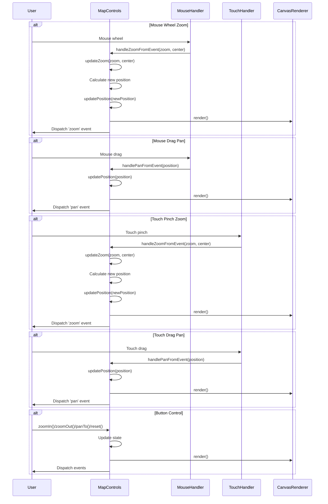

# MapControls Class

The `MapControls` class is the main entry point for the Map Controls module. It provides methods for initializing, controlling, and interacting with the map.

## Import

```typescript
import { MapControls } from 'map-controls';
```

## Constructor

```typescript
constructor(options: MapControlsOptions)
```

Creates a new instance of the MapControls class.

### Parameters

| Parameter | Type | Description |
|-----------|------|-------------|
| `options` | `MapControlsOptions` | Configuration options for the map controls |

### Example

```typescript
const mapControls = new MapControls({
  container: document.getElementById('map-container'),
  mapSrc: 'path/to/map.jpg',
  initialZoom: 1,
  minZoom: 0.5,
  maxZoom: 3,
  showControls: true,
  controlsPosition: 'bottom-right'
});
```

## Properties

The MapControls class has the following properties:

| Property | Type | Access | Description |
|----------|------|--------|-------------|
| `options` | `MapControlsOptions` | private | Configuration options |
| `container` | `HTMLElement` | private | The container element |
| `originalContainer` | `HTMLElement` | private | The original container element |
| `state` | `MapState` | private | Current map state |
| `eventManager` | `EventManager` | private | Event manager instance |
| `renderer` | `CanvasRenderer` | private | Renderer instance |
| `mouseHandler` | `MouseHandler \| null` | private | Mouse handler instance |
| `touchHandler` | `TouchHandler \| null` | private | Touch handler instance |
| `controlsManager` | `ControlsManager \| null` | private | Controls manager instance |
| `initialized` | `boolean` | private | Whether the map is initialized |

## Public Methods

### on

```typescript
on(type: EventType, handler: EventHandler): void
```

Adds an event listener for the specified event type.

#### Parameters

| Parameter | Type | Description |
|-----------|------|-------------|
| `type` | `EventType` | The type of event to listen for |
| `handler` | `EventHandler` | The event handler function |

#### Example

```typescript
mapControls.on('zoom', (level) => {
  console.log(`Zoom level changed to: ${level}`);
});
```

### off

```typescript
off(type: EventType, handler: EventHandler): void
```

Removes an event listener for the specified event type.

#### Parameters

| Parameter | Type | Description |
|-----------|------|-------------|
| `type` | `EventType` | The type of event to remove |
| `handler` | `EventHandler` | The event handler function to remove |

#### Example

```typescript
const zoomHandler = (level) => {
  console.log(`Zoom level: ${level}`);
};

// Add event listener
mapControls.on('zoom', zoomHandler);

// Remove event listener
mapControls.off('zoom', zoomHandler);
```

### zoomIn

```typescript
zoomIn(factor?: number): void
```

Zooms in the map by the specified factor or the default zoom step.

#### Parameters

| Parameter | Type | Default | Description |
|-----------|------|---------|-------------|
| `factor` | `number` | `options.zoomStep` | The zoom factor to apply |

#### Example

```typescript
// Zoom in by the default step
mapControls.zoomIn();

// Zoom in by a custom factor
mapControls.zoomIn(0.2);
```

### zoomOut

```typescript
zoomOut(factor?: number): void
```

Zooms out the map by the specified factor or the default zoom step.

#### Parameters

| Parameter | Type | Default | Description |
|-----------|------|---------|-------------|
| `factor` | `number` | `options.zoomStep` | The zoom factor to apply |

#### Example

```typescript
// Zoom out by the default step
mapControls.zoomOut();

// Zoom out by a custom factor
mapControls.zoomOut(0.2);
```

### panTo

```typescript
panTo(x: number, y: number): void
```

Pans the map to the specified position.

#### Parameters

| Parameter | Type | Description |
|-----------|------|-------------|
| `x` | `number` | The x-coordinate to pan to |
| `y` | `number` | The y-coordinate to pan to |

#### Example

```typescript
// Pan to a specific position
mapControls.panTo(100, 200);
```

### reset

```typescript
reset(): void
```

Resets the map to its initial state (zoom level and position).

#### Example

```typescript
// Reset the map
mapControls.reset();
```

### setMapSrc

```typescript
setMapSrc(mapSrc: string): Promise<void>
```

Changes the map source image.

#### Parameters

| Parameter | Type | Description |
|-----------|------|-------------|
| `mapSrc` | `string` | The path to the new map image |

#### Returns

A Promise that resolves when the map is loaded.

#### Example

```typescript
// Change the map source
mapControls.setMapSrc('path/to/new-map.jpg')
  .then(() => {
    console.log('Map source changed successfully');
  })
  .catch((error) => {
    console.error('Failed to change map source:', error);
  });
```

### showControls

```typescript
showControls(): void
```

Shows the map controls if they are hidden.

#### Example

```typescript
// Show controls
mapControls.showControls();
```

### hideControls

```typescript
hideControls(): void
```

Hides the map controls.

#### Example

```typescript
// Hide controls
mapControls.hideControls();
```

### getState

```typescript
getState(): MapState
```

Gets the current state of the map.

#### Returns

A copy of the current map state.

#### Example

```typescript
// Get current state
const state = mapControls.getState();
console.log('Current zoom level:', state.zoom);
console.log('Current position:', state.position);
```

### destroy

```typescript
destroy(): void
```

Destroys the map controls and cleans up resources.

#### Example

```typescript
// Destroy map controls
mapControls.destroy();
```

## Private Methods

### init

```typescript
private async init(): Promise<void>
```

Initializes the map controls.

### centerMap

```typescript
private centerMap(): void
```

Centers the map in the container.

### updatePosition

```typescript
private updatePosition(position: Position): void
```

Updates the map position.

### updateZoom

```typescript
private updateZoom(zoom: number, center?: Position): void
```

Updates the zoom level.

### render

```typescript
private render(): void
```

Renders the map with the current state.

### Event Handlers

The following private methods handle events from the UI controls and interaction handlers:

- `handlePanFromEvent`: Handles pan events from mouse/touch handlers
- `handleZoomFromEvent`: Handles zoom events from mouse/touch handlers
- `handleZoomIn`: Handles zoom in button clicks
- `handleZoomOut`: Handles zoom out button clicks
- `handlePanDirection`: Handles pan direction button clicks
- `handleReset`: Handles reset button clicks

## Initialization Flow

The following diagram shows the initialization flow of the MapControls class:



## Interaction Flow

The following diagram shows the interaction flow for zoom and pan operations:



## Related Interfaces

- [MapControlsOptions](types.md#mapcontrolsoptions)
- [MapState](types.md#mapstate)
- [Position](types.md#position)
- [Size](types.md#size)
- [EventType](types.md#eventtype)
- [EventHandler](types.md#eventhandler)

## See Also

- [EventManager](eventmanager.md)
- [CanvasRenderer](canvasrenderer.md)
- [MouseHandler](mousehandler.md)
- [TouchHandler](touchhandler.md)
- [ControlsManager](controlsmanager.md)
