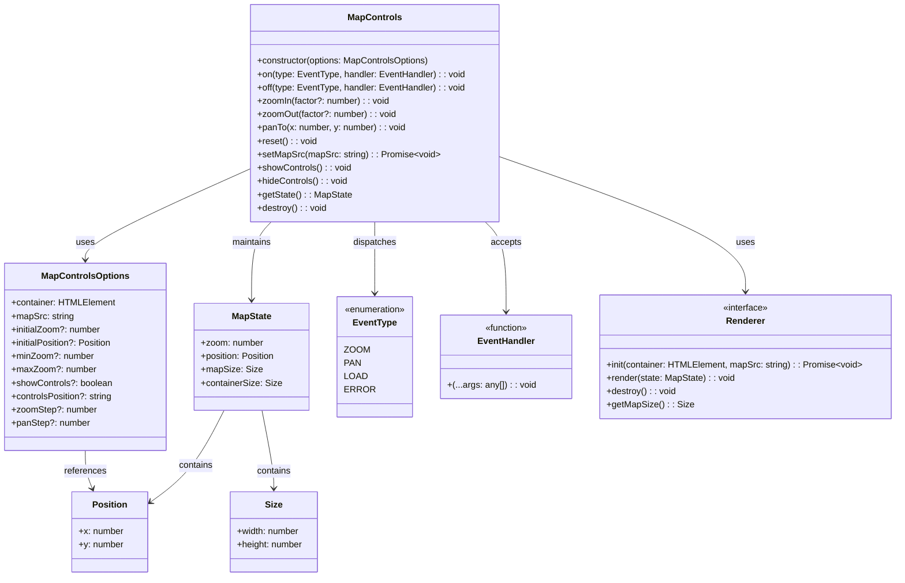

# Types and Interfaces

This page documents all the TypeScript types and interfaces used in the Map Controls module.

## Core Types

### Position

```typescript
interface Position {
  x: number;
  y: number;
}
```

Represents a position with x and y coordinates.

#### Properties

| Property | Type | Description |
|----------|------|-------------|
| `x` | `number` | The x-coordinate |
| `y` | `number` | The y-coordinate |

#### Usage Example

```typescript
const position: Position = { x: 100, y: 200 };
mapControls.panTo(position.x, position.y);
```

### Size

```typescript
interface Size {
  width: number;
  height: number;
}
```

Represents dimensions with width and height.

#### Properties

| Property | Type | Description |
|----------|------|-------------|
| `width` | `number` | The width dimension |
| `height` | `number` | The height dimension |

#### Usage Example

```typescript
const size: Size = { width: 800, height: 600 };
console.log(`Map size: ${size.width}x${size.height}`);
```

## Configuration

### MapControlsOptions

```typescript
interface MapControlsOptions {
  /** DOM element to contain the map */
  container: HTMLElement;
  /** Path to the map image */
  mapSrc: string;
  /** Initial zoom level (default: 1) */
  initialZoom?: number;
  /** Initial position (default: centered) */
  initialPosition?: Position;
  /** Minimum zoom level (default: 0.5) */
  minZoom?: number;
  /** Maximum zoom level (default: 3) */
  maxZoom?: number;
  /** Whether to show control buttons (default: true) */
  showControls?: boolean;
  /** Position of the controls (default: 'bottom-right') */
  controlsPosition?: 'top-left' | 'top-right' | 'bottom-left' | 'bottom-right';
  /** Zoom step for zoom in/out operations (default: 0.1) */
  zoomStep?: number;
  /** Pan step for pan operations in pixels (default: 50) */
  panStep?: number;
}
```

Configuration options for the MapControls class.

#### Properties

| Property | Type | Required | Default | Description |
|----------|------|----------|---------|-------------|
| `container` | `HTMLElement` | Yes | - | DOM element to contain the map |
| `mapSrc` | `string` | Yes | - | Path to the map image |
| `initialZoom` | `number` | No | `1` | Initial zoom level |
| `initialPosition` | `Position` | No | `null` | Initial position (null means center) |
| `minZoom` | `number` | No | `0.5` | Minimum zoom level |
| `maxZoom` | `number` | No | `3` | Maximum zoom level |
| `showControls` | `boolean` | No | `true` | Whether to show control buttons |
| `controlsPosition` | `string` | No | `'bottom-right'` | Position of the controls |
| `zoomStep` | `number` | No | `0.1` | Zoom step for zoom in/out operations |
| `panStep` | `number` | No | `50` | Pan step for pan operations in pixels |

#### Usage Example

```typescript
const options: MapControlsOptions = {
  container: document.getElementById('map-container')!,
  mapSrc: 'assets/world-map.jpg',
  initialZoom: 1,
  initialPosition: { x: -1500, y: 0 }, // Position to show the Pacific Ocean
  minZoom: 0.5,
  maxZoom: 1.5,
  showControls: true,
  controlsPosition: 'bottom-right',
  zoomStep: 0.1,
  panStep: 50
};

const mapControls = new MapControls(options);
```

## State

### MapState

```typescript
interface MapState {
  /** Current zoom level */
  zoom: number;
  /** Current position */
  position: Position;
  /** Map dimensions */
  mapSize: Size;
  /** Container dimensions */
  containerSize: Size;
}
```

Represents the current state of the map.

#### Properties

| Property | Type | Description |
|----------|------|-------------|
| `zoom` | `number` | Current zoom level |
| `position` | `Position` | Current position |
| `mapSize` | `Size` | Map dimensions |
| `containerSize` | `Size` | Container dimensions |

#### Usage Example

```typescript
const state = mapControls.getState();
console.log(`Current zoom: ${state.zoom}`);
console.log(`Current position: ${state.position.x}, ${state.position.y}`);
console.log(`Map size: ${state.mapSize.width}x${state.mapSize.height}`);
console.log(`Container size: ${state.containerSize.width}x${state.containerSize.height}`);
```

## Events

### EventType

```typescript
type EventType = 'zoom' | 'pan' | 'load' | 'error';
```

Defines the types of events that can be dispatched by the map controls.

#### Values

| Value | Description |
|-------|-------------|
| `'zoom'` | Fired when the zoom level changes |
| `'pan'` | Fired when the map is panned |
| `'load'` | Fired when the map is loaded |
| `'error'` | Fired when an error occurs |

#### Usage Example

```typescript
// Listen for zoom events
mapControls.on('zoom', (level) => {
  console.log(`Zoom level changed to: ${level}`);
});

// Listen for pan events
mapControls.on('pan', (position) => {
  console.log(`Map panned to position: ${position.x}, ${position.y}`);
});
```

### EventHandler

```typescript
type EventHandler = (...args: any[]) => void;
```

Defines the signature for event handler functions.

#### Usage Example

```typescript
const zoomHandler: EventHandler = (level) => {
  console.log(`Zoom level: ${level}`);
};

mapControls.on('zoom', zoomHandler);
```

### EventListener

```typescript
interface EventListener {
  type: EventType;
  handler: EventHandler;
}
```

Represents an event listener with a type and handler function.

#### Properties

| Property | Type | Description |
|----------|------|-------------|
| `type` | `EventType` | The type of event |
| `handler` | `EventHandler` | The event handler function |

## Rendering

### Renderer

```typescript
interface Renderer {
  /** Initialize the renderer */
  init(container: HTMLElement, mapSrc: string): Promise<void>;
  /** Render the map with current state */
  render(state: MapState): void;
  /** Clean up resources */
  destroy(): void;
  /** Get the map size */
  getMapSize(): Size;
}
```

Interface for map renderers.

#### Methods

| Method | Return Type | Description |
|--------|-------------|-------------|
| `init` | `Promise<void>` | Initializes the renderer |
| `render` | `void` | Renders the map with the current state |
| `destroy` | `void` | Cleans up resources |
| `getMapSize` | `Size` | Gets the map size |

## Type Relationships

The following diagram shows the relationships between the main types and interfaces:



## See Also

- [MapControls Class](mapcontrols.md)
- [Constants](constants.md)
- [EventManager](eventmanager.md)
