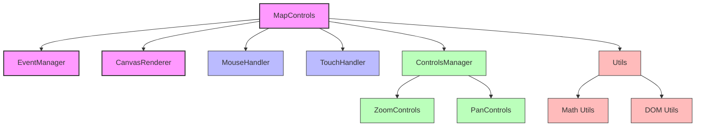

# Map Controls Documentation

Welcome to the official documentation for the Map Controls module, a framework-agnostic TypeScript library for map panning and zooming.

  
  
A powerful, lightweight solution for interactive maps

## Overview

Map Controls is a TypeScript module that provides pan and zoom functionality for custom maps. It's designed to be framework-agnostic, making it compatible with any JavaScript project. Whether you're building a web application with React, Angular, Vue, or vanilla JavaScript, Map Controls can be easily integrated to provide interactive map features.

## Key Features

- **Framework Agnostic**: Works with any JavaScript framework or vanilla JS
- **TypeScript Support**: Full TypeScript definitions for enhanced development experience
- **Pan & Zoom**: Smooth panning and zooming functionality for custom maps
- **Boundary Constraints**: Configurable boundaries to control pan and zoom limits
- **Mouse & Touch Support**: Works with both mouse and touch interactions
- **Control Buttons**: Optional UI controls for zoom and pan operations
- **Event System**: Comprehensive event system for tracking user interactions
- **Extendable Architecture**: Designed to be extended for custom requirements

## Quick Navigation

  <a href="guides/getting-started.md" class="nav-item">
    <h3>🚀 Getting Started</h3>
    
Quick start guide to integrate Map Controls into your project

  </a>
  <a href="guides/installation.md" class="nav-item">
    <h3>📦 Installation</h3>
    
Step-by-step installation instructions

  </a>
  <a href="api/index.md" class="nav-item">
    <h3>📚 API Reference</h3>
    
Detailed API documentation for all components

  </a>
  <a href="examples/index.md" class="nav-item">
    <h3>💡 Examples</h3>
    
Code examples and usage scenarios

  </a>
  <a href="guides/advanced-usage.md" class="nav-item">
    <h3>🔧 Advanced Usage</h3>
    
Advanced techniques and customization options

  </a>
  <a href="guides/contributing.md" class="nav-item">
    <h3>👥 Contributing</h3>
    
Guidelines for contributing to the project

  </a>

## Architecture Overview

The Map Controls module is built with a modular architecture that separates concerns into distinct components:

## Getting Help

If you encounter any issues or have questions about using Map Controls, please check the [Troubleshooting](guides/troubleshooting.md) guide or [open an issue](https://github.com/your-repo/map-controls/issues) on GitHub.

  
Map Controls is licensed under the MIT License.

